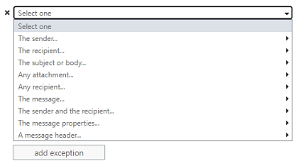

# Email exfiltration controls for connectors

 Microsoft Exchange allows admins to disable email auto-forwards and auto-replies to remote domains (external recipients) by using specific message type headers such as ‘Auto-forward’ received from Outlook and Outlook on the web clients.  

Similarly, Power Platform has the inbuilt ability to insert specific SMTP headers in emails sent through Power Automate and Power Apps using the Microsoft 365 Exchange/Outlook connector. These SMTP headers can now be used to set up appropriate exfiltration (unauthorized transfer of data from one device to another) rules in Exchange for outbound emails.  

For more details on the Microsoft 365 Outlook connector, see: [SMTP headers](https://docs.microsoft.com/connectors/office365/#smtp-headers). 

## Block exfiltration of forwarded emails 

Admins can set up Exchange mail flow rules to monitor or block emails sent by Power Automate and/or Power Apps using the Microsoft 365 Outlook connector. The format of the SMTP header sent by Power Platform is as follows. A reserved word ‘Microsoft Power Automate’ or ‘Microsoft Power Apps’ is inserted with the header type: ‘x-ms-mail-application’. For example:

```
**x-ms-mail-application: Microsoft Power Automate**; User-Agent: 
azure-logic-apps/1.0 (workflow afa0fb167803450aa650267e95d43287; version 
08586093372199532216) microsoft-flow/1.0 
x-ms-mail-operation-type: Forward 
```

Further, in order to identify the operation ID, a reserved word ‘Forward’ or ‘Reply’ or ‘Send’ is inserted with the header type: ‘x-ms-mail-operation-type’. For example:

```
x-ms-mail-application: Microsoft Power Automate; User-Agent: 
azure-logic-apps/1.0 (workflow afa0fb167803450aa650267e95d43287; version 
08586093372199532216) microsoft-flow/1.0 
**x-ms-mail-operation-type: Forward**
```

Exchange admins can use these headers to set up exfiltration blocking rules in the Exchange admin center as enumerated in the example below. Here the ‘mail flow’ rule rejects outbound email messages with:  

- ‘x-ms-mail-operation-type’ header set as ‘Forward’ and  
- ‘x-ms-mail-application’ header set as ‘Microsoft Power Automate’  

This is equivalent to the Exchange ‘mail flow’ rule set up for message type equal to ‘auto-forward’ while using Outlook and Outlook on the web clients. 

:::image type="content" source="media/block-outbound-forwards80.png" alt-text="Block outbound forwards":::

## Exempt specific flows from exfiltration blocking

In addition to the new ‘x-ms-mail-application’, Power Platform also inserts the workflow identifier as the new ‘User-Agent’ header which is equal to the app or flow ID.  

```
x-ms-mail-application: Microsoft Power Automate; User-Agent: 
azure-logic-apps/1.0 (workflow afa0fb167803450aa650267e95d43287; version 
08586093372199532216) microsoft-flow/1.0 
**x-ms-mail-operation-type: Forward**
```

If admins wanted to exempt some flows (or apps) from the exfiltration due to a legitimate business scenario, they can use the workflow ID as part of the user-agent header to do the same. All other exception conditions offered by Exchange rules such as sender address also remain available to exempt the legitimate business use cases from the blocking enforcement. 

:::image type="content" source="media/block-outbound-forwards-exception85.png" alt-text="Block outbound forwards exceptions":::

Alternately, admins can use other exception capabilities in Exchange mail rules to exempt flows from the exfiltration blocking rules (for example, a unique sender address) to allow legitimate business use cases to bypass the control. 

> [!div class="mx-imgBorder"] 
> 